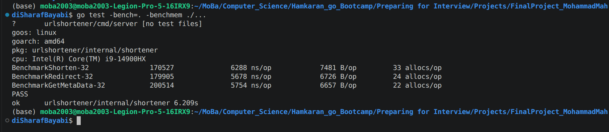
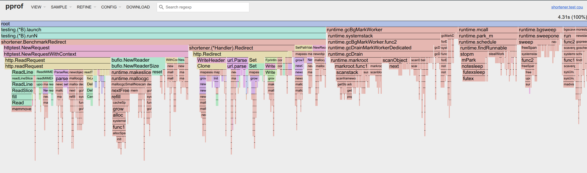
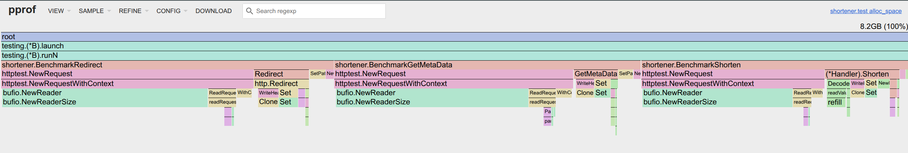

## Performance & Benchmarks (Phase 3)

### 1. Benchmark Results

Execution output for `go test -bench=. -benchmem ./...`:



---

### 2. Performance Profiling (`pprof` Analysis)
### Commands usesd for CPU and Memory Profiling :
 `go test -bench=. -cpuprofile=cpu.pprof ./internal/shortener`
 `go test -bench=. -memprofile=mem.pprof ./internal/shortener`

#### Profiling Insights
Analysis of CPU and Memory execution profiles using `pprof` revealed the following key insights from the benchmark runs:

- **CPU Profile (`cpu.pprof`):**
  - **Redirect Execution Path (`GET /{code}`):** The execution profile shows that `(*Handler).Redirect` (accounting for 18.10% cumulative CPU time) spends the majority of its processing time inside HTTP pipeline operations (`net/http.readRequest` at 18.10% cum and `net/http.Redirect` at 16.24% cum).
  - **Runtime & Memory Management:** Go runtime garbage collection and memory allocation routines (`runtime.mallocgc` at 24.83% cum, `runtime.gcDrain` at 19.26% cum, and `runtime.futex` at 6.50% flat) account for a significant portion of total CPU time during benchmark execution.

- **Memory Profile (`mem.pprof` - `alloc_space`):**
  - **HTTP Request Buffering & Parsing:** Over 60% of total memory allocations (4.96 GB out of 8.20 GB total) originate from HTTP request buffering (`bufio.NewReaderSize`) inside `httptest.NewRequest` and `net/http.readRequest`.
  - **HTTP Header Overhead:** Header cloning and MIME header manipulations (`net/http.Header.Clone` at 5.89% and `MIMEHeader.Set` at 5.38%) represent major allocation sources during request processing.
  - **Handler Memory Breakdown:** Among application handlers, `(*Handler).Shorten` accounts for 8.26% (0.68 GB) cumulative allocations, `(*Handler).Redirect` accounts for 6.13% (0.50 GB), and `(*Handler).GetMetaData` accounts for 4.90% (0.40 GB). URL normalization (`net/url.parse`) accounts for 3.62% (0.30 GB) of total memory allocations.

#### `pprof` Flame Graph
visual graph generated via `go tool pprof -http=:8080 cpu.pprof`:




visual graph generated via `go tool pprof -http=:8080 mem.pprof`:




#### Terminal Output
Output for `go tool pprof -top cpu.pprof`:

```text
(base) moba2003@moba2003-Legion-Pro-5-16IRX9:~/MoBa/Computer_Science/Hamkaran_go_Bootcamp/Preparing for Interview/Projects/FinalProject_MohammadMahdiSharafBayabi$ go tool pprof -top cpu.pprof
File: shortener.test
Build ID: 73b58ca8e2dc52d1ca4fbface0b413c665bdf15c
Type: cpu
Time: 2026-10-07 18:30:10 +0330
Duration: 2.23s, Total samples = 4.31s (193.24%)
Showing nodes accounting for 3.10s, 71.93% of 4.31s total
Dropped 182 nodes (cum <= 0.02s)
      flat  flat%   sum%        cum   cum%
     0.28s  6.50%  6.50%      0.28s  6.50%  runtime.futex
     0.17s  3.94% 10.44%      0.17s  3.94%  runtime.memmove
     0.13s  3.02% 13.46%      0.13s  3.02%  runtime.memclrNoHeapPointers
     0.11s  2.55% 16.01%      0.11s  2.55%  runtime.nextFreeFast (inline)
     0.10s  2.32% 18.33%      0.30s  6.96%  runtime.scanObject
     0.09s  2.09% 20.42%      0.12s  2.78%  runtime.typePointers.next
     0.08s  1.86% 22.27%      0.10s  2.32%  runtime.(*mspan).writeHeapBitsSmall
     0.08s  1.86% 24.13%      0.08s  1.86%  runtime.madvise
     0.08s  1.86% 25.99%      0.12s  2.78%  runtime.tryDeferToSpanScan
     0.07s  1.62% 27.61%      0.07s  1.62%  aeshashbody
     0.07s  1.62% 29.23%      0.07s  1.62%  runtime.(*lfstack).pop
     0.06s  1.39% 30.63%      0.08s  1.86%  bufio.(*Reader).reset (inline)
     0.06s  1.39% 32.02%      1.07s 24.83%  runtime.mallocgc
     0.06s  1.39% 33.41%      0.06s  1.39%  runtime.typePointers.nextFast (inline)
     0.05s  1.16% 34.57%      0.78s 18.10%  net/http.readRequest
     0.05s  1.16% 35.73%      0.08s  1.86%  net/textproto.CanonicalMIMEHeaderKey
     0.05s  1.16% 36.89%      0.12s  2.78%  runtime.(*spanSet).push
     0.05s  1.16% 38.05%      0.05s  1.16%  runtime.(*sysMemStat).add
     0.05s  1.16% 39.21%      0.11s  2.55%  runtime.lock2
     0.05s  1.16% 40.37%      0.05s  1.16%  runtime.procyieldAsm
     0.05s  1.16% 41.53%      0.12s  2.78%  runtime.scanblock
     0.05s  1.16% 42.69%      0.12s  2.78%  runtime.stealWork
     0.04s  0.93% 43.62%      0.18s  4.18%  runtime.(*mheap).allocSpan
     0.04s  0.93% 44.55%      0.05s  1.16%  runtime.unlock2
     0.03s   0.7% 45.24%      0.03s   0.7%  internal/runtime/atomic.(*Uint32).Add (inline)
     0.03s   0.7% 45.94%      0.03s   0.7%  internal/runtime/atomic.(*Uint32).CompareAndSwap (inline)
     0.03s   0.7% 46.64%      0.03s   0.7%  internal/runtime/atomic.(*Uintptr).Store (inline)
     0.03s   0.7% 47.33%      0.70s 16.24%  net/http.Redirect
     0.03s   0.7% 48.03%      0.03s   0.7%  net/textproto.validHeaderFieldByte (inline)
     0.03s   0.7% 48.72%      0.06s  1.39%  net/url.(*URL).setPath
     0.03s   0.7% 49.42%      0.26s  6.03%  net/url.parse
     0.03s   0.7% 50.12%      0.33s  7.66%  runtime.(*mcache).refill
     0.03s   0.7% 50.81%      0.11s  2.55%  runtime.(*mheap).freeSpanLocked
     0.03s   0.7% 51.51%      0.04s  0.93%  runtime.(*pallocBits).summarize
     0.03s   0.7% 52.20%      0.03s   0.7%  runtime.(*randomEnum).next (inline)
     0.03s   0.7% 52.90%      0.05s  1.16%  runtime.findObject
     0.03s   0.7% 53.60%      0.83s 19.26%  runtime.gcDrain
     0.03s   0.7% 54.29%      0.05s  1.16%  runtime.gcmarknewobject
     0.03s   0.7% 54.99%      0.12s  2.78%  runtime.getempty
     0.03s   0.7% 55.68%      0.56s 12.99%  runtime.mallocgcSmallScanNoHeader
     0.03s   0.7% 56.38%      0.39s  9.05%  runtime.markroot
     0.03s   0.7% 57.08%      0.54s 12.53%  runtime.newobject
     0.03s   0.7% 57.77%      0.06s  1.39%  runtime.scanObjectsSmall
     0.03s   0.7% 58.47%      0.03s   0.7%  runtime.spanClass.sizeclass (inline)
     0.03s   0.7% 59.16%      0.78s 18.10%  urlshortener/internal/shortener.(*Handler).Redirect
     0.02s  0.46% 59.63%      0.18s  4.18%  bufio.(*Reader).ReadSlice
     0.02s  0.46% 60.09%      0.08s  1.86%  bytes.(*Buffer).Write
     0.02s  0.46% 60.56%      0.04s  0.93%  gcWriteBarrier
     0.02s  0.46% 61.02%      0.03s   0.7%  internal/runtime/maps.(*Iter).Next
     0.02s  0.46% 61.48%      0.03s   0.7%  internal/stringslite.Cut
     0.02s  0.46% 61.95%      0.22s  5.10%  net/http.Header.Clone (inline)
     0.02s  0.46% 62.41%      0.07s  1.62%  net/http.readTransfer
     0.02s  0.46% 62.88%      0.20s  4.64%  net/textproto.(*Reader).readLineSlice
     0.02s  0.46% 63.34%      0.05s  1.16%  net/textproto.(*Reader).upcomingHeaderKeys
     0.02s  0.46% 63.81%      0.07s  1.62%  runtime.(*stkframe).getStackMap
     0.02s  0.46% 64.27%      0.27s  6.26%  runtime.(*sweepLocked).sweep
     0.02s  0.46% 64.73%      0.07s  1.62%  runtime.concatstrings
     0.02s  0.46% 65.20%      0.33s  7.66%  runtime.mallocgcSmallNoscan
     0.02s  0.46% 65.66%      0.04s  0.93%  runtime.pcvalue
     0.02s  0.46% 66.13%      2.39s 55.45%  urlshortener/internal/shortener.BenchmarkRedirect
     0.01s  0.23% 66.36%      0.04s  0.93%  internal/runtime/maps.(*Iter).Init
     0.01s  0.23% 66.59%      0.18s  4.18%  internal/runtime/maps.(*Map).growToSmall
     0.01s  0.23% 66.82%      0.03s   0.7%  internal/runtime/maps.rand
     0.01s  0.23% 67.05%      0.09s  2.09%  net/http.(*Request).WithContext (inline)
     0.01s  0.23% 67.29%      1.36s 31.55%  net/http/httptest.NewRequestWithContext
     0.01s  0.23% 67.52%      0.11s  2.55%  net/url.ParseRequestURI
     0.01s  0.23% 67.75%      0.03s   0.7%  net/url.escape
     0.01s  0.23% 67.98%      0.35s  8.12%  runtime.(*mcache).nextFree
     0.01s  0.23% 68.21%      0.20s  4.64%  runtime.(*mcentral).grow
     0.01s  0.23% 68.45%      0.06s  1.39%  runtime.(*mheap).initSpan
     0.01s  0.23% 68.68%      0.03s   0.7%  runtime.(*spanSet).pop
     0.01s  0.23% 68.91%      0.03s   0.7%  runtime.(*wbBuf).get2 (inline)
     0.01s  0.23% 69.14%      0.05s  1.16%  runtime.bulkBarrierPreWrite
     0.01s  0.23% 69.37%      0.97s 22.51%  runtime.gcBgMarkWorker
     0.01s  0.23% 69.61%      0.03s   0.7%  runtime.greyobject
     0.01s  0.23% 69.84%      0.03s   0.7%  runtime.mapIterNext
     0.01s  0.23% 70.07%      0.27s  6.26%  runtime.mapassign_faststr
     0.01s  0.23% 70.30%      0.27s  6.26%  runtime.markroot.func1
     0.01s  0.23% 70.53%      0.14s  3.25%  runtime.newarray
     0.01s  0.23% 70.77%      0.21s  4.87%  runtime.notesleep
     0.01s  0.23% 71.00%      0.03s   0.7%  runtime.scanObjectSmall
     0.01s  0.23% 71.23%      0.16s  3.71%  runtime.scanframeworker
     0.01s  0.23% 71.46%      0.48s 11.14%  runtime.schedule
     0.01s  0.23% 71.69%      0.25s  5.80%  runtime.stopm
     0.01s  0.23% 71.93%      0.04s  0.93%  strings.Cut (inline)
         0     0% 71.93%      0.18s  4.18%  bufio.(*Reader).ReadLine
         0     0% 71.93%      0.15s  3.48%  bufio.(*Reader).fill
         0     0% 71.93%      0.40s  9.28%  bufio.NewReader (inline)
         0     0% 71.93%      0.40s  9.28%  bufio.NewReaderSize (inline)
         0     0% 71.93%      0.05s  1.16%  bytes.(*Buffer).grow
         0     0% 71.93%      0.09s  2.09%  fmt.Fprintln
         0     0% 71.93%      0.03s   0.7%  internal/runtime/maps.(*Map).getWithoutKeySmallFastStr
         0     0% 71.93%      0.05s  1.16%  internal/runtime/maps.NewEmptyMap (inline)
         0     0% 71.93%      0.05s  1.16%  internal/runtime/maps.NewMap
         0     0% 71.93%      0.14s  3.25%  internal/runtime/maps.newGroups (inline)
         0     0% 71.93%      0.14s  3.25%  internal/runtime/maps.newarray
         0     0% 71.93%      0.03s   0.7%  net/http.(*Request).PathValue (inline)
         0     0% 71.93%      0.13s  3.02%  net/http.(*Request).SetPathValue (inline)
         0     0% 71.93%      0.05s  1.16%  net/http.Header.Del (inline)
         0     0% 71.93%      0.12s  2.78%  net/http.Header.Set (inline)
         0     0% 71.93%      0.78s 18.10%  net/http.ReadRequest
         0     0% 71.93%      0.05s  1.16%  net/http.fixLength
         0     0% 71.93%      0.03s   0.7%  net/http.parseRequestLine
         0     0% 71.93%      0.08s  1.86%  net/http/httptest.(*ResponseRecorder).Write
         0     0% 71.93%      0.22s  5.10%  net/http/httptest.(*ResponseRecorder).WriteHeader
         0     0% 71.93%      0.10s  2.32%  net/http/httptest.NewRecorder (inline)
         0     0% 71.93%      1.36s 31.55%  net/http/httptest.NewRequest (inline)
         0     0% 71.93%      0.18s  4.18%  net/textproto.(*Reader).ReadLine (inline)
         0     0% 71.93%      0.13s  3.02%  net/textproto.(*Reader).ReadMIMEHeader (inline)
         0     0% 71.93%      0.04s  0.93%  net/textproto.(*Reader).readContinuedLineSlice
         0     0% 71.93%      0.05s  1.16%  net/textproto.MIMEHeader.Del (inline)
         0     0% 71.93%      0.12s  2.78%  net/textproto.MIMEHeader.Set (inline)
         0     0% 71.93%      0.13s  3.02%  net/textproto.readMIMEHeader
         0     0% 71.93%      0.16s  3.71%  net/url.Parse
         0     0% 71.93%      0.03s   0.7%  net/url.parseAuthority
         0     0% 71.93%      0.04s  0.93%  runtime.(*gcWork).balance
         0     0% 71.93%      0.03s   0.7%  runtime.(*gcWork).init
         0     0% 71.93%      0.05s  1.16%  runtime.(*mcache).prepareForSweep
         0     0% 71.93%      0.03s   0.7%  runtime.(*mcache).releaseAll
         0     0% 71.93%      0.20s  4.64%  runtime.(*mcentral).cacheSpan
         0     0% 71.93%      0.12s  2.78%  runtime.(*mcentral).uncacheSpan
         0     0% 71.93%      0.15s  3.48%  runtime.(*mheap).alloc
         0     0% 71.93%      0.15s  3.48%  runtime.(*mheap).alloc.func1
         0     0% 71.93%      0.03s   0.7%  runtime.(*mheap).allocManual
         0     0% 71.93%      0.12s  2.78%  runtime.(*mheap).freeSpan (inline)
         0     0% 71.93%      0.04s  0.93%  runtime.(*mheap).nextSpanForSweep
         0     0% 71.93%      0.04s  0.93%  runtime.(*mspan).initHeapBits
         0     0% 71.93%      0.05s  1.16%  runtime.(*pageAlloc).free
         0     0% 71.93%      0.09s  2.09%  runtime.(*pageAlloc).scavenge
         0     0% 71.93%      0.09s  2.09%  runtime.(*pageAlloc).scavenge.func1
         0     0% 71.93%      0.09s  2.09%  runtime.(*pageAlloc).scavengeOne
         0     0% 71.93%      0.04s  0.93%  runtime.(*pageAlloc).update
         0     0% 71.93%      0.09s  2.09%  runtime.(*scavengerState).init.func2
         0     0% 71.93%      0.09s  2.09%  runtime.(*scavengerState).run
         0     0% 71.93%      0.05s  1.16%  runtime.(*stackScanState).addObject
         0     0% 71.93%      0.12s  2.78%  runtime.(*sweepLocked).sweep.(*mheap).freeSpan.func2
         0     0% 71.93%      0.09s  2.09%  runtime.bgscavenge
         0     0% 71.93%      0.33s  7.66%  runtime.bgsweep
         0     0% 71.93%      0.03s   0.7%  runtime.concatstring4
         0     0% 71.93%      0.04s  0.93%  runtime.concatstring5
         0     0% 71.93%      0.12s  2.78%  runtime.deductAssistCredit
         0     0% 71.93%      0.46s 10.67%  runtime.findRunnable
         0     0% 71.93%      0.08s  1.86%  runtime.forEachP (inline)
         0     0% 71.93%      0.08s  1.86%  runtime.forEachPInternal
         0     0% 71.93%      0.24s  5.57%  runtime.futexsleep
         0     0% 71.93%      0.04s  0.93%  runtime.futexwakeup
         0     0% 71.93%      0.12s  2.78%  runtime.gcAssistAlloc
         0     0% 71.93%      0.12s  2.78%  runtime.gcAssistAlloc.func2
         0     0% 71.93%      0.12s  2.78%  runtime.gcAssistAlloc1
         0     0% 71.93%      0.83s 19.26%  runtime.gcBgMarkWorker.func2
         0     0% 71.93%      0.78s 18.10%  runtime.gcDrainMarkWorkerDedicated (inline)
         0     0% 71.93%      0.05s  1.16%  runtime.gcDrainMarkWorkerIdle (inline)
         0     0% 71.93%      0.09s  2.09%  runtime.gcDrainN
         0     0% 71.93%      0.10s  2.32%  runtime.gcMarkDone
         0     0% 71.93%      0.05s  1.16%  runtime.gcMarkDone.forEachP.func5
         0     0% 71.93%      0.03s   0.7%  runtime.gcMarkTermination
         0     0% 71.93%      0.03s   0.7%  runtime.gcMarkTermination.forEachP.func7
         0     0% 71.93%      0.03s   0.7%  runtime.gcMarkTermination.func4
         0     0% 71.93%      0.06s  1.39%  runtime.gcStart
         0     0% 71.93%      0.04s  0.93%  runtime.gcstopm
         0     0% 71.93%      0.03s   0.7%  runtime.getempty.func1
         0     0% 71.93%      0.09s  2.09%  runtime.gopreempt_m (inline)
         0     0% 71.93%      0.09s  2.09%  runtime.goschedImpl
         0     0% 71.93%      0.10s  2.32%  runtime.heapSetTypeNoHeader (inline)
         0     0% 71.93%      0.11s  2.55%  runtime.lock (inline)
         0     0% 71.93%      0.11s  2.55%  runtime.lockWithRank (inline)
         0     0% 71.93%      0.21s  4.87%  runtime.mPark (inline)
         0     0% 71.93%      0.05s  1.16%  runtime.makemap
         0     0% 71.93%      0.05s  1.16%  runtime.makemap_small
         0     0% 71.93%      0.36s  8.35%  runtime.makeslice
         0     0% 71.93%      0.05s  1.16%  runtime.mapIterStart
         0     0% 71.93%      0.03s   0.7%  runtime.mapaccess1_faststr
         0     0% 71.93%      0.09s  2.09%  runtime.markrootBlock
         0     0% 71.93%      0.44s 10.21%  runtime.mcall
         0     0% 71.93%      0.09s  2.09%  runtime.morestack
         0     0% 71.93%      0.04s  0.93%  runtime.newMarkBits
         0     0% 71.93%      0.09s  2.09%  runtime.newstack
         0     0% 71.93%      0.04s  0.93%  runtime.notetsleep
         0     0% 71.93%      0.04s  0.93%  runtime.notetsleep_internal
         0     0% 71.93%      0.03s   0.7%  runtime.notewakeup
         0     0% 71.93%      0.44s 10.21%  runtime.park_m
         0     0% 71.93%      0.05s  1.16%  runtime.procyield (inline)
         0     0% 71.93%      0.03s   0.7%  runtime.rawstring (inline)
         0     0% 71.93%      0.03s   0.7%  runtime.rawstringtmp
         0     0% 71.93%      0.09s  2.09%  runtime.scanSpan
         0     0% 71.93%      0.21s  4.87%  runtime.scanstack
         0     0% 71.93%      0.03s   0.7%  runtime.stopTheWorldWithSema
         0     0% 71.93%      0.04s  0.93%  runtime.suspendG
         0     0% 71.93%      0.31s  7.19%  runtime.sweepone
         0     0% 71.93%      0.08s  1.86%  runtime.sysUnused (inline)
         0     0% 71.93%      0.08s  1.86%  runtime.sysUnusedOS
         0     0% 71.93%      1.54s 35.73%  runtime.systemstack
         0     0% 71.93%      0.05s  1.16%  runtime.unlock (partial-inline)
         0     0% 71.93%      0.05s  1.16%  runtime.unlockWithRank (inline)
         0     0% 71.93%      0.03s   0.7%  runtime.wakep
         0     0% 71.93%      0.04s  0.93%  runtime.wbBufFlush
         0     0% 71.93%      0.04s  0.93%  runtime.wbBufFlush.func1
         0     0% 71.93%      0.04s  0.93%  runtime.wbBufFlush1
         0     0% 71.93%      0.05s  1.16%  runtime.wbMove
         0     0% 71.93%      0.15s  3.48%  strings.(*Reader).Read
         0     0% 71.93%      0.05s  1.16%  strings.NewReader (inline)
         0     0% 71.93%      2.39s 55.45%  testing.(*B).launch
         0     0% 71.93%      2.39s 55.45%  testing.(*B).runN

```
Output for `go tool pprof -top mem.pprof`: 

```text
(base) moba2003@moba2003-Legion-Pro-5-16IRX9:~/MoBa/Computer_Science/Hamkaran_go_Bootcamp/Preparing for Interview/Projects/FinalProject_MohammadMahdiSharafBayabi$ go tool pprof -top mem.pprof
File: shortener.test
Build ID: 73b58ca8e2dc52d1ca4fbface0b413c665bdf15c
Type: alloc_space
Time: 2026-10-07 18:56:40 +0330
Showing nodes accounting for 8.03GB, 97.87% of 8.20GB total
Dropped 54 nodes (cum <= 0.04GB)
      flat  flat%   sum%        cum   cum%
    4.96GB 60.51% 60.51%     4.96GB 60.51%  bufio.NewReaderSize (inline)
    0.48GB  5.89% 66.39%     0.48GB  5.89%  net/http.Header.Clone (inline)
    0.44GB  5.38% 71.77%     0.44GB  5.38%  net/textproto.MIMEHeader.Set (inline)
    0.39GB  4.71% 76.48%     0.39GB  4.71%  net/http.(*Request).WithContext (inline)
    0.38GB  4.61% 81.09%     0.67GB  8.23%  net/http.readRequest
    0.30GB  3.62% 84.71%     0.30GB  3.62%  net/url.parse
    0.28GB  3.47% 88.18%     0.28GB  3.47%  net/http.(*Request).SetPathValue (inline)
    0.20GB  2.46% 90.64%     0.20GB  2.46%  net/http/httptest.NewRecorder (inline)
    0.17GB  2.08% 92.72%     0.17GB  2.08%  encoding/json.(*Decoder).refill
    0.11GB  1.36% 94.08%     0.11GB  1.36%  encoding/json.NewDecoder (inline)
    0.06GB  0.76% 94.84%     0.06GB  0.76%  net/textproto.readMIMEHeader
    0.05GB  0.62% 95.46%     0.09GB  1.12%  bytes.(*Buffer).grow
    0.04GB  0.52% 95.97%     0.04GB  0.52%  net/textproto.(*Reader).ReadLine (inline)
    0.04GB   0.5% 96.47%     0.04GB   0.5%  bytes.growSlice
    0.04GB  0.48% 96.96%     0.50GB  6.13%  net/http.Redirect
    0.04GB  0.43% 97.39%     6.10GB 74.41%  net/http/httptest.NewRequestWithContext
    0.02GB  0.24% 97.63%     0.68GB  8.26%  urlshortener/internal/shortener.(*Handler).Shorten
    0.02GB  0.24% 97.87%     0.40GB  4.90%  urlshortener/internal/shortener.(*Handler).GetMetaData
         0     0% 97.87%     4.96GB 60.51%  bufio.NewReader (inline)
         0     0% 97.87%     0.09GB  1.12%  bytes.(*Buffer).Write
         0     0% 97.87%     0.21GB  2.60%  encoding/json.(*Decoder).Decode
         0     0% 97.87%     0.18GB  2.17%  encoding/json.(*Decoder).readValue
         0     0% 97.87%     0.09GB  1.08%  encoding/json.(*Encoder).Encode
         0     0% 97.87%     0.44GB  5.38%  net/http.Header.Set (inline)
         0     0% 97.87%     0.67GB  8.23%  net/http.ReadRequest
         0     0% 97.87%     0.09GB  1.12%  net/http/httptest.(*ResponseRecorder).Write
         0     0% 97.87%     0.48GB  5.89%  net/http/httptest.(*ResponseRecorder).WriteHeader
         0     0% 97.87%     6.10GB 74.41%  net/http/httptest.NewRequest (inline)
         0     0% 97.87%     0.06GB  0.76%  net/textproto.(*Reader).ReadMIMEHeader (inline)
         0     0% 97.87%     0.12GB  1.40%  net/url.Parse
         0     0% 97.87%     0.18GB  2.21%  net/url.ParseRequestURI
         0     0% 97.87%     8.20GB   100%  testing.(*B).launch
         0     0% 97.87%     8.20GB   100%  testing.(*B).runN
         0     0% 97.87%     0.50GB  6.13%  urlshortener/internal/shortener.(*Handler).Redirect
         0     0% 97.87%     0.07GB  0.81%  urlshortener/internal/shortener.(*URLStore).Shorten
         0     0% 97.87%     2.77GB 33.80%  urlshortener/internal/shortener.BenchmarkGetMetaData
         0     0% 97.87%     3.01GB 36.70%  urlshortener/internal/shortener.BenchmarkRedirect
         0     0% 97.87%     2.42GB 29.45%  urlshortener/internal/shortener.BenchmarkShorten
         0     0% 97.87%     0.07GB  0.81%  urlshortener/internal/shortener.NormalizeURL
         
```